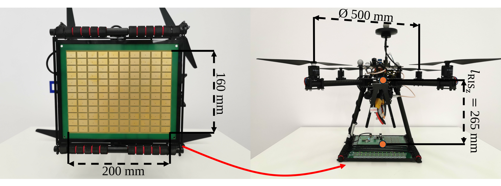
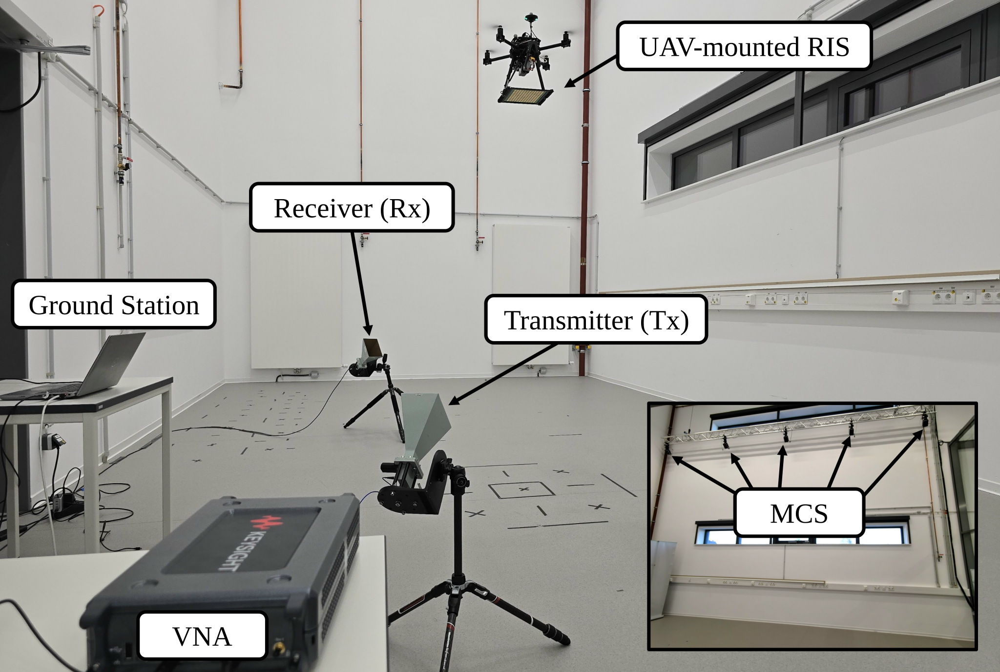

# LIVE-RIS: The UAV-mounted RIS dataset

This repository contains a measurement dataset collected during indoor flight experiments with a **UAV-mounted Reconfigurable Intelligent Surface (RIS)**.
The dataset comprises EKF-based state estimates of both UAV and RIS, ground-truth measurements, RIS configurations derived via optimization, and the corresponding S21 channel measurements acquired using a vector network analyzer (VNA). In addition, we consider multiple transmitter (Tx), receiver (Rx), and UAV-mounted RIS deployment locations, enabling analysis of divers relative geometries.

This README provides an overview of the system configuration, hardware specifications, and conducted measurement campaigns included in this dataset. For a detailed description of the methodology, experimental setup, calibration procedures, and evaluation results, readers are referred to the associated publication.

---

## Contact

[David Müller](https://lrs.ruhr-uni-bochum.de/en/team/david-muller/)                 <david.mueller-r21@ruhr-uni-bochum.de>

[Kevin Weinberger](https://www.dks.ruhr-uni-bochum.de/en/profiles/kevin-weinberger/) <evin.weinberger@ruhr-uni-bochum.de>

---

## License

Any use of the dataset which results in an academic publication or other publication must include a citation of our paper:

D. Müller, K. Weinberger, A. Sezgin and M. Mönnigmann, "LIVE-RIS: The UAV-mounted RIS Dataset," 2027 IEEE ...

```
@INPROCEEDINGS{9839223, 
author={},
booktitle={},
title={},
year={2027},
volume={},  
number={},
pages={},
doi={}}
```

This dataset is released for non-commercial research and educational purposes.

---

## Overview

Reconfigurable Intelligent Surfaces (RIS) are a promising technology for enhancing wireless communication by dynamically controlling the phase of reflected signals. This dataset investigates the performance of a UAV-mounted RIS acting as an airborne relay between a transmitter (Tx) and receiver (Rx).

All experiments were conducted in a flight lab under identical environmental conditions.

The NWU frame is defined as:
- x-axis: North
- y-axis: West
- z-axis: Up

Attitudes are represented using XYZ roll-pitch-yaw Euler angles in radians.

---

## Dataset Structure

The dataset is organized hierarchically: **Scenario → RIS Configuration → Flight**.

```
risdataset/
├── Scenario_i/
│   ├── DynamicRIS_a/
│   │   ├── Flight1/
│   │   └── Flight2/
│   ├── StaticRIS_b/
│   │   ├── Flight1/
│   │   └── Flight2/
│   └── OffRIS_c/
│       ├── Flight1/
│       │    └──<filename>.csv
│       └── Flight2/
│            └──<filename>.csv
├── Scenario_ii/   (same structure)
└── Scenario_iii/  (same structure)
```

Each file contains **10 seconds** of timestamped, synchronized measurement data in `.csv` format at a frequency of 50 Hertz. All units are specified in the respective file headers and summarized in the following table:

| Column | Unit | Description |
|---|---|---|
| Timestamp | ns | UNIX timestamp |
| UAV Position: x | m | UAV EKF position in NWU frame |
| UAV Position: y | m | UAV EKF position in NWU frame |
| UAV Position: z | m | UAV EKF position in NWU frame |
| UAV Attitude: roll | rad | UAV roll angle |
| UAV Attitude: pitch | rad | UAV pitch angle |
| UAV Attitude: yaw | rad | UAV yaw angle |
| RIS Position: x | m | Estimated RIS position in NWU frame |
| RIS Position: y | m | Estimated RIS position in NWU frame |
| RIS Position: z | m | Estimated RIS position in NWU frame |
| RIS Attitude: roll | rad | Estimated RIS roll angle |
| RIS Attitude: pitch | rad | Estimated RIS pitch angle |
| RIS Attitude: yaw | rad | Estimated RIS yaw angle |
| RIS configuration | binary vector | Current RIS phase profile |
| S21 Magnitude | dB | Measured channel magnitude |

RIS configurations are stored as **binary row vectors** (one entry per element). Each entry corresponds to the phase state of one RIS element (0 or 1, encoding a 0° or 180° phase shift).

The mapping between vector and RIS patch is as follows:

---

## Experimental Setup

### RIS Prototype

The **RIS prototype** used for measurements has dimensions of 20 × 16 cm and consists of M = 120 elements arranged in a 10 × 12 array. We use a Raspberry Pi 4B as the RIS controller, which is connected to the RIS via a serial port with a baud rate of 115200 Bd. The key specifications of the prototype are summarized in the following table:

| Parameter | Value |
|---|---|
| Dimensions | 20 × 16 cm |
| Number of elements | 120 (10 × 12 array) |
| Phase shifting | 1-bit (PIN diode per element, 180° shift) |
| Carrier frequency | 5.385 GHz |
| Phase-shift attenuation | 3 dB |
| Max. reconfiguration rate | 50 Hz |

### UAV Platform — Customized Holybro X500

The UAV carrying the RIS is a customized **Holybro X500 Quadcopter** (rotor-to-rotor diameter: 500 mm), capable of carrying up to 1 kg of payload. The flight controller runs **ArduPilot V4.6.3** and features three IMUs (ICM20602, ICM20948, ICM20649) for redundancy.

Since experiments are conducted indoors (no GNSS available), a **Motion Capture System (MCS)** provides position measurements at 5 Hz, substituting GNSS, barometer, and magnetometer inputs to the Extended Kalman Filter (EKF). An ESP8266 microcontroller running MAVESP8266 firmware relays MCS data to the flight controller wirelessly.

The RIS is mounted under the UAV, where its center is located 265 mm underneath the origin of the UAV's body frame, with no offsets in the x-y-plane.
The Raspberry Pi is mounted on top of the UAV, with almost no vertical offset, and no offsets in the x-y-plane.

<p align="center">
  
  <br><em>Figure 2: Left: RIS prototype and its dimensions. Right: RIS prototype mounted to the customized Holybro X500. Orange dots represent the origin of the UAV body frame (top) and the center of the RIS (bottom).</em>
</p>

### Vector Network Analyzer (VNA)

Wireless channel performance is measured using a **Keysight P5026B VNA** with the S9010B software option, which enables time-gating to isolate the signal component only reflected by the RIS. Two VNA ports serve as the transmitter and receiver, respectively, and are each connected to a directional horn antenna of type LB-187-15-C-SF (A-Info). Within the considered frequency range, the antenna gain is at least 16.35 dBi. The measurements are conducted in 50 Hertz intervals.

<p align="center">
  
  <br><em>Figure 3: Experimental setup. Inset shows the placement of the motion capture cameras.</em>
</p>

---

## Scenarios

Three deployment scenarios are considered to cover both optimal and non-ideal relative geometries between Tx, Rx, and the UAV-mounted RIS. The UAV hovers at a fixed target position in all scenarios. The scenarios key features are summarized in the following table:

| Scenario | UAV-RIS Target Position | Tx Position | Rx Position | Description |
|---|---|---|---|---|
| (i) | (0, 0, 2) m | (−1.36, 0, 0.7) m | (1.34, 0, 0.7) m | RIS at midpoint of Tx–Rx direct link (optimal geometry) |
| (ii) | (1.2, 0, 2) m | (−1.36, 0, 0.66) m | (1.55, 0, 0.75) m | RIS directly above Rx |
| (iii) | (0, 0, 2) m | (−1.55, 0.75, 0.7) m | (1.65, 0.77, 0.69) m | RIS not along the direct Tx–Rx path (non-ideal geometry) |

In each scenario, Tx and Rx are oriented towards the target position of the UAV-mounted RIS.

## RIS Configurations

For each scenario, three RIS configurations are evaluated with **two flights per configuration** (6 flights per scenario, 18 flights total):

| Configuration | Label | Description |
|---|---|---|
| Dynamic (a) | `DynamicRIS` | RIS phase profile continuously updated at 50 Hz based on the UAV's current EKF position estimate |
| Static; pre-computed (b) | `StaticRIS` | RIS phase profile optimized once prior to flight for the target position, then kept constant |
| Off; passive (c) | `OffRIS` | No phase shifts applied — equivalent to a passive metallic reflector |

