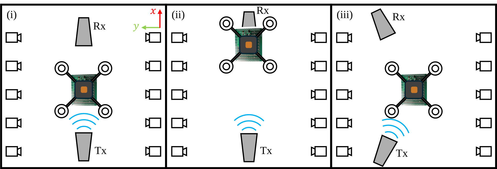

# UAV-Mounted RIS Dataset

This repository contains a scientific measurement dataset collected during indoor flight experiments with a **UAV-mounted Reconfigurable Intelligent Surface (RIS)**. The dataset captures pose estimates, RIS configurations, and wireless channel measurements across three spatial deployment scenarios and three RIS operating modes, with two repeated flights each.

---

## Overview

Reconfigurable Intelligent Surfaces (RIS) are a promising technology for enhancing wireless communication by dynamically controlling the phase of reflected signals. This dataset investigates the performance of a UAV-mounted RIS acting as an airborne relay between a transmitter (Tx) and receiver (Rx) in an indoor laboratory environment.

All attitude and position information are provided in the **NWU (North-West-Up) frame**. All experiments were conducted in a flight lab under identical environmental conditions.

<p align="center">
  
  <br><em>Figure 1: Schematic illustration of the three experimental scenarios.</em>
</p>

---

## Experimental Setup

### UAV Platform — Holybro X500

The UAV carrying the RIS is a customized **Holybro X500 Quadcopter** (rotor-to-rotor diameter: 500 mm), capable of carrying up to 1 kg of payload. The flight controller runs **ArduPilot V4.6.3** and features three IMUs (ICM20602 primary, ICM20948 secondary, and a third on-board unit) for redundancy and lane-switching.

Since experiments are conducted indoors (no GNSS available), a **Motion Capture System (MCS)** provides position ground truth at 5 Hz, substituting GNSS, barometer, and magnetometer inputs to the Extended Kalman Filter (EKF). An ESP8266 microcontroller running MAVESP8266 firmware relays MCS data to the flight controller wirelessly.

<p align="center">
  
  <br><em>Figure 2: Left: RIS prototype and its dimensions. Right: RIS prototype mounted to the customized Holybro X500. Orange dots represent the origin of the UAV body frame (top) and the center of the RIS (bottom).</em>
</p>

### RIS Prototype

| Parameter | Value |
|---|---|
| Dimensions | 20 × 16 cm |
| Number of elements | 120 (10 × 12 array) |
| Phase shifting | 1-bit (PIN diode per element, 180° shift) |
| Carrier frequency | 5.385 GHz |
| Phase-shift attenuation | 3 dB |
| Max. reconfiguration rate | 50 Hz |
| RIS controller | Raspberry Pi 4B (serial, 115200 Bd) |

The RIS is mounted underneath the UAV; its center is located **265 mm below the UAV body frame origin**, with no lateral offset.

### Vector Network Analyzer (VNA)

Wireless channel performance is measured using a **Keysight P5026B VNA** with the S9010B software option, enabling time-gated S-parameter measurements to validate RIS performance during flight.

<p align="center">
  
  <br><em>Figure 3: Experimental setup for scenario (iii). Inset shows the placement of the motion capture cameras.</em>
</p>

---

## Scenarios

Three deployment scenarios are considered to cover both optimal and non-ideal relative geometries between Tx, Rx, and the UAV-mounted RIS. The UAV hovers at a fixed target position (guided mode) in all scenarios. IMUs are recalibrated before every flight.

| Scenario | UAV-RIS Target Position | Tx Position | Rx Position | Description |
|---|---|---|---|---|
| (i) | (0, 0, 2) m | (−1.36, 0, 0.7) m | (1.34, 0, 0.7) m | RIS at midpoint of Tx–Rx direct link (optimal geometry) |
| (ii) | (1.2, 0, 2) m | (−1.36, 0, 0.66) m | (1.55, 0, 0.75) m | RIS directly above Rx |
| (iii) | (0, 0, 2) m | (−1.55, 0.75, 0.7) m | (1.65, 0.77, 0.69) m | RIS not along the direct Tx–Rx path (non-ideal geometry) |

In each scenario, Tx and Rx are oriented towards the UAV-RIS target position.

---

## RIS Configurations

For each scenario, three RIS configurations are evaluated with **two flights per configuration** (6 flights per scenario, 18 flights total):

| Configuration | Label | Description |
|---|---|---|
| Active (dynamic) | `ActiveRIS` | RIS phase profile continuously updated at 50 Hz based on the UAV's current EKF position estimate |
| Static (pre-computed) | `StaticRIS` | RIS phase profile optimized once prior to flight for the target position, then kept constant |
| Off (passive) | `OffRIS` | No phase shifts applied — equivalent to a passive metallic reflector |

RIS configurations are stored as **binary row vectors** (one entry per element). Each entry corresponds to the phase state of one RIS element (0 or 1, encoding a 0° or 180° phase shift).

---

## Dataset Structure

The dataset is organized hierarchically: **Scenario → RIS Configuration → Flight**.

```
risdataset/
├── Scenario_i/
│   ├── ActiveRIS/
│   │   ├── Flight1/
│   │   └── Flight2/
│   ├── StaticRIS/
│   │   ├── Flight1/
│   │   └── Flight2/
│   └── OffRIS/
│       ├── Flight1/
│       └── Flight2/
├── Scenario_ii/   (same structure)
├── Scenario_iii/  (same structure)
└── imgs/
```

<p align="center">
  
  <br><em>Figure 4: Dataset file hierarchy.</em>
</p>

Each flight folder contains **10 seconds** of timestamped, synchronized measurement data in `.csv` format. All timestamps and units are specified in the respective file headers.

### File Naming Convention

Files follow the pattern:

```
Scenario_{scenario}_{RISconfig}_{source}_{datatype}_Flight{N}.csv
```

| Field | Possible Values | Description |
|---|---|---|
| `{scenario}` | `i`, `ii`, `iii` | Experimental scenario |
| `{RISconfig}` | `ActiveRIS`, `StaticRIS`, `OffRIS` | RIS configuration |
| `{source}` | `EKF`, `MCS`, `VNA` | Data source |
| `{datatype}` | `RISPose`, `UAVPose`, `Config`, `Magnitudes` | Type of recorded data |
| `{N}` | `1`, `2` | Flight repetition number |

**Example:** `Scenario_iii_StaticRIS_EKF_RISPose_Flight1.csv` — EKF-estimated RIS pose (position + attitude) from scenario (iii) with static RIS configuration, first flight.

### File Types per Flight

| File | Source | Contents |
|---|---|---|
| `*_EKF_RISPose_*` | EKF | Estimated RIS position and attitude (derived from UAV EKF estimate) |
| `*_EKF_UAVPose_*` | EKF | Estimated UAV position and attitude |
| `*_MCS_RISPose_*` | MCS | Ground-truth RIS position and attitude |
| `*_MCS_UAVPose_*` | MCS | Ground-truth UAV position and attitude |
| `*_EKF_Config_*` | EKF | RIS configuration (binary vector) at each timestep |
| `*_VNA_Magnitudes_*` | VNA | Measured S-parameter magnitudes (wireless channel) |

> **Note:** Both EKF estimates and MCS ground-truth measurements are included for UAV and RIS pose to facilitate reproducibility and error analysis.

---

## Coordinate Frame

All position and attitude data are provided in the **NWU (North-West-Up)** frame.

---

## Hardware Summary

| Component | Model / Details |
|---|---|
| UAV | Holybro X500 (customized) |
| Flight Controller | Cube Orange (ArduPilot V4.6.3) |
| Primary IMU | ICM20602 |
| Secondary IMU | ICM20948 |
| RIS Controller | Raspberry Pi 4B |
| Motion Capture System | Indoor MCS (5 Hz position + attitude) |
| VNA | Keysight P5026B + S9010B option |
| WiFi Bridge | ESP8266 + MAVESP8266 firmware |

---

## Citation

If you use this dataset in your work, please cite the associated publication (to be added).

---

## License

To be added.
